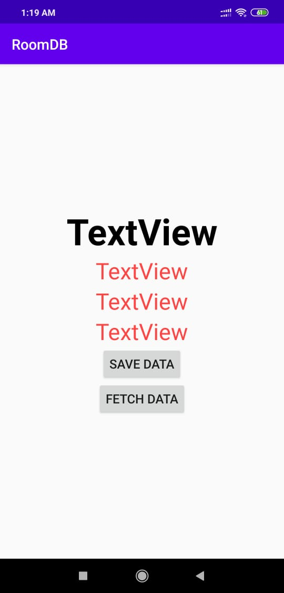
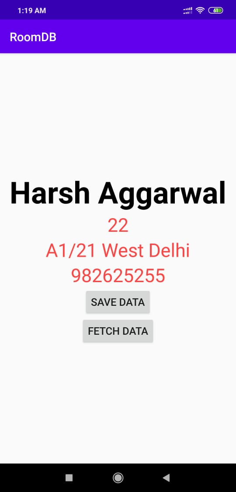

# ANDROID_12_RoomDB

Room is a persistence library, part of the Android Architecture Components. It makes it easier to work with SQLiteDatabase objects in your app, decreasing the amount of boilerplate code and verifying SQL queries at compile time.

